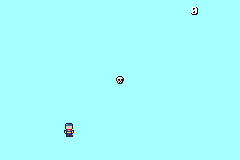

# Skull Rush

Grab the skulls, but be careful. The more skulls you collect, the more zombies spawn and chase after you! Skull Rush is a Game Boy Advance game where you try to collect as many skulls as you can before the zombies catch you.

## Play it

[Play Skull Rush here](https://alexandrbalan.github.io/collectathon/)

## How to play

- **D-pad:** move your square. It spins while you move, and it spins faster during a boost.
- **A button:** speed boost. You only get 3 per game, so use them wisely.
- **Start:** reset the game.
- Run off one edge of the screen and you come out the other side.
- Each skull you grab adds 1 to your score and changes the background to a random color.
- Each skull you get, one zombie spawns in. A total of 10 zombies can be spawned in